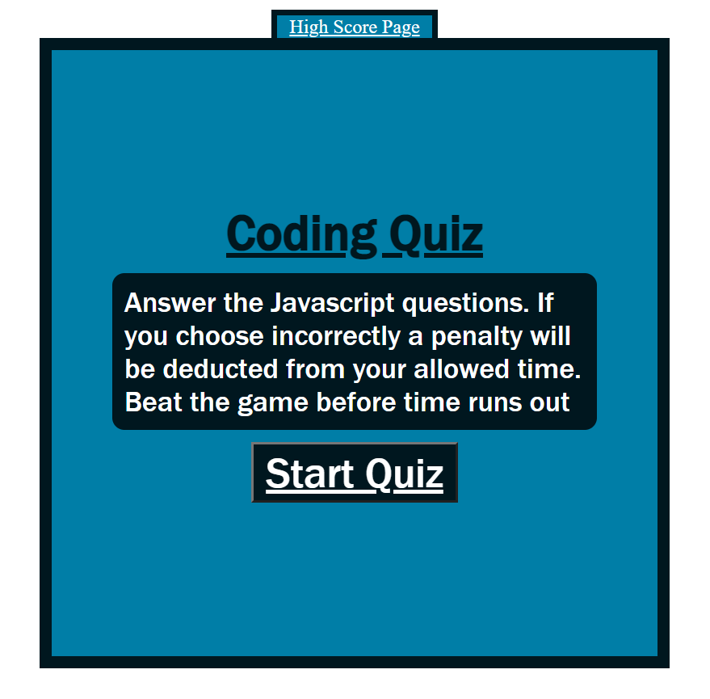

# code_quiz
This is a code quiz that asks a series of questions(provided in the gif of the assignment) related to Javascript. The user is prompted to start the quiz which starts a timer, this starts the quiz and asks a series of questions. If the quesions are answered correctly, the next question will populated, and no penalty will be deducted. However, if a question is answered incorrectly, a penalty of 20seconds will be deducted from the 100seconds alloted. You may also store your score locally at the end of the quiz.

https://aabazary.github.io/code_quiz/

